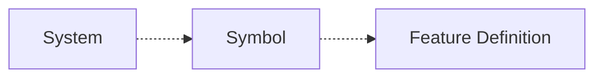
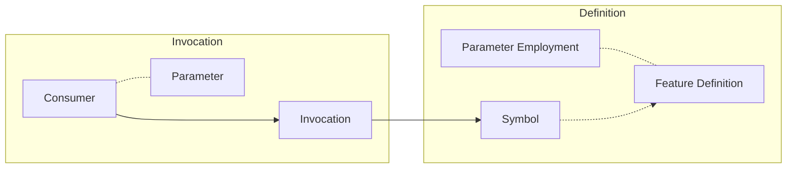

# Ramifications

## Symbol

A symbol is an object that is accessible by a unique identificator or by a system that has invoked it.

At the definition time, it contains only its feature definition. Therefore, a symbol does not contain within itself a name, description, or any other self-referential information.

When a feature definition employs a parameter, its symbol can be referenced as a template.

## Feature

A feature can be a literal value or an invocation.

A feature definition that contains one or more invocations can leverage other simbols by reinterpreting them.

A symbol reinterpretation can be performed by a restrict set of semantic statements or templates enacting emergence.

A feature definition can be enhanced by employing a single parameter. (see diagram)

## System

## Invocation

## Consumer

## Literal

## Parameter
